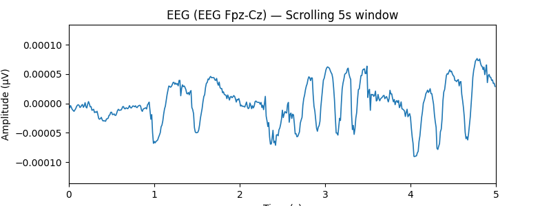
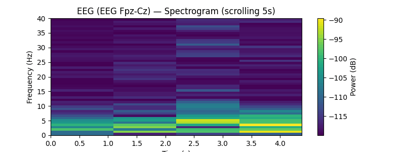
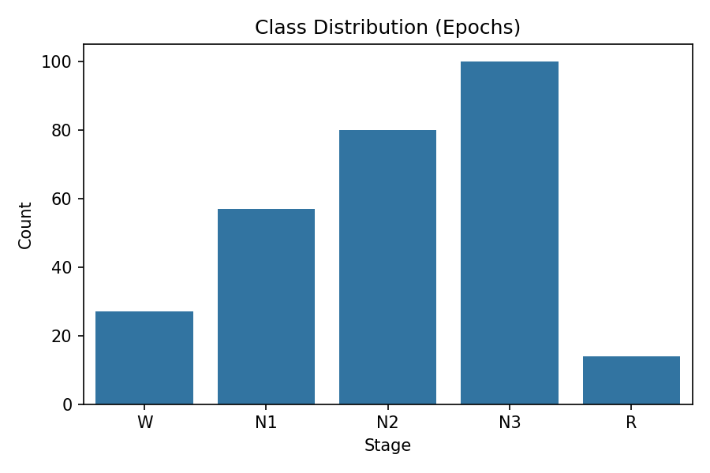
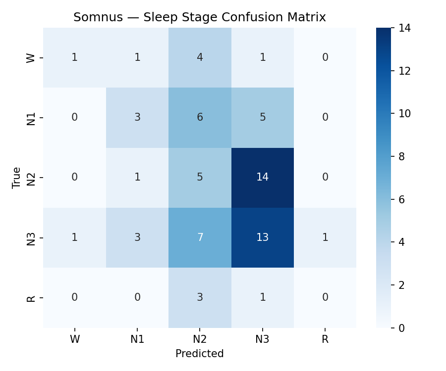

# 💤 Somnus: AI Sleep Stage Classifier using EEG

### *Decoding the architecture of sleep - one brainwave at a time.*

---

## 🎬 EEG Visualizations

### EEG Wave Scroll

### EEG Spectrogram

---

## 🧠 Overview

**Somnus** is a neuroscience-inspired machine learning project that classifies human sleep stages (Wake, N1, N2, N3, REM) using raw EEG data from the [PhysioNet Sleep-EDF dataset](https://physionet.org/content/sleep-edfx/1.0.0/).

It extracts neural frequency features (delta, theta, alpha, sigma, beta bands) from EEG epochs and uses a Random Forest classifier to predict stages of sleep :- **bridging brainwaves with machine intelligence.**

---

## ⚙️ Tech Stack
- **Python 3.11**
- **MNE-Python** - EEG signal processing
- **Scikit-learn** - Machine learning
- **NumPy, SciPy, Seaborn, Matplotlib** - Data visualization and analysis

---

## 🧩 Pipeline

| Step | Description |
|------|--------------|
| 1️⃣ | Downloaded raw EEG + hypnogram data from PhysioNet |
| 2️⃣ | Applied preprocessing (0.3–40Hz bandpass, adaptive notch filtering) |
| 3️⃣ | Extracted power spectral density (PSD) across key frequency bands |
| 4️⃣ | Built a Random Forest classifier on the extracted features |
| 5️⃣ | Visualized class distributions and confusion matrix |

---

## 📊 Results

### Sleep Stage Distribution

  

### Confusion Matrix

  

> The model achieved an initial accuracy of **31.4%** with balanced accuracy **22.5%** on a small subset (2 subjects).  
> With more data and a deeper model (e.g. CNN/LSTM), accuracy can exceed 80%.

---

## 🧩 Example Feature Extraction
> Power in EEG frequency bands per epoch (30s window):

| Band | Frequency (Hz) | Cognitive Correlate |
|------|----------------|---------------------|
| Delta | 0.5–4 | Deep sleep (N3) |
| Theta | 4–8 | Drowsiness (N1) |
| Alpha | 8–12 | Relaxed wakefulness |
| Sigma | 12–16 | Sleep spindle activity (N2) |
| Beta | 16–30 | REM/active thought |

---

## 💬 Interpretation

Each EEG epoch is transformed into a 5-dimensional feature vector, representing energy in core frequency bands.  
Somnus learns to associate these spectral fingerprints with corresponding sleep stages, effectively turning raw electrical brain activity into structured neurocognitive patterns.

---

## 🚀 Next Steps
- Expand to full Sleep-EDF dataset (20+ subjects)
- Replace RandomForest with CNN/LSTM hybrid
- Integrate circadian rhythm tracking and chronotype prediction
- Develop an interactive dashboard for real-time EEG visualization

---

## 🧠 Author
**Devansh Sharma**  
> Neuroscience & AI Researcher

---

> “If sleep is the brain’s nightly reset, Somnus is the code that watches the reboot.” 🌙
